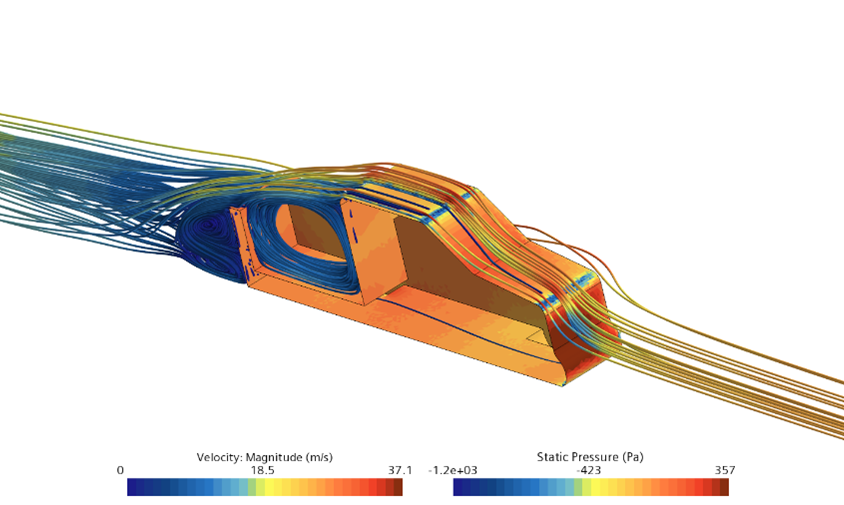

# Pickup Truck Wake Analysis

In this project, a CFD study to see the effects of pickup truck bed lengths on vortex behavior was conducted.
* The report is the cfd.truckbeds.pdf file
* Solidworks drawings and CAD models are included in the "Geometry" folder

This is an assignment I submitted as part of the Advanced Vehicle Aerodynamics course at Oxford Brookes.
The geometry can be used for future work, please note the license and cite/acknowledge accordingly.
